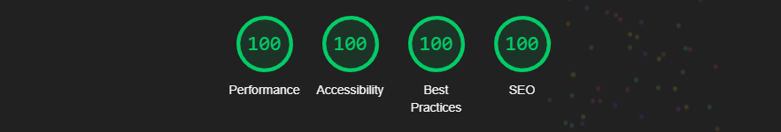
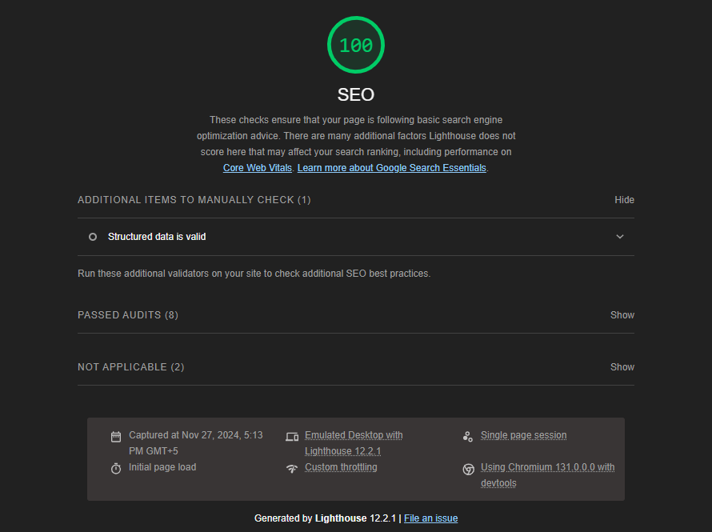

# [Saadullah Khan | Portfolio](https://saadullahkhan3.github.io/)

Welcome to my portfolio website, uniquely designed and packed with fantastic effects!

### **Website Link:** https://saadullahkhan3.github.io/

---

## 🌟 New Features Added

### ✨ Enhanced Glassmorphism with Intelligent Dark Mode
- **Automatic Dark Mode Adaptation**: Glassmorphism effects naturally adapt to system dark mode through backdrop-filter properties
- **Manual Theme Toggle**: Interactive button for user-controlled theme switching
- **"Faded White" Technique**: Achieved using `rgba(255, 255, 255, 0.24)` for optimal transparency
- **Smooth Transitions**: 0.3s ease animations for seamless theme changes
- **Persistent Storage**: User preference saved in localStorage

### 🎨 How the Dark Mode "Magic" Works
The glassmorphism automatically adapts without explicit dark mode CSS through:
1. **backdrop-filter: blur(18.2px)** - Blurs content behind elements
2. **Semi-transparent overlay** - Low opacity white background (0.24)
3. **System integration** - When OS switches to dark mode, backdrop becomes darker
4. **Natural reflection** - Blur picks up darker colors automatically

For detailed explanation, see: [GLASSMORPHISM_DARK_MODE_EXPLANATION.md](./GLASSMORPHISM_DARK_MODE_EXPLANATION.md)

---

## 🧩 Design Highlights:
- **Glassmorphism:** A modern visual design technique for a sleek look.
- **GSAP Effects:** Bounding animation with staggered stair-like motion.
- **Skills Section:** Infinite auto-scroll with bouncy skill tags on hover.
- **Projects Section:** Interactive card-stacking effect.
- **Contact Section:** Image-follow hover effect for engaging visuals.
- **Dark Mode Toggle:** Smart theme switching with system preference detection.

---

## 💻 Tech Stack
- ### **Development:**
    - JavaScript (JS)
    - GSAP
    - CSS
    - HTML

- ### **Deployment:**
    - GitHub Action
        - Used to host website.
    - GitHub Pages
        - Used to create pipeline to minify code of developed version for deployed version.

---

# **🌟 Website Overview**

# **📊 Performance Metrics**
## **Performace:**

## **Accessibility:**

## **Best Practices:**

## **SEO:**

---

<h2 id="saadullah-khan"><a href="https://www.linkedin.com/in/saadullahkhan3/">🔗 Saadullah Khan</a></h2>
